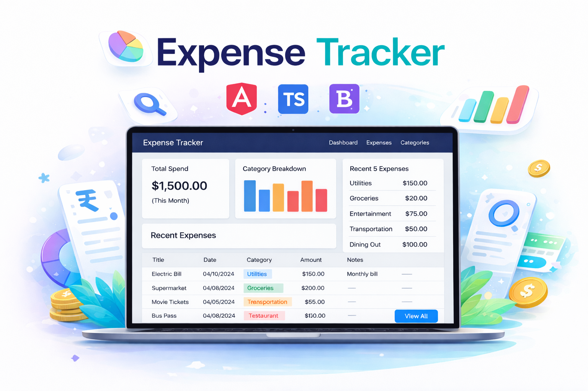

# 💰 Expense Tracker – Angular

A modern, responsive Expense Tracker built with Angular that helps users manage expenses, categorize spending, analyze monthly totals, and visualize top spending categories.

This project focuses on clean frontend architecture, reusable component design, API abstraction patterns, and real-world dashboard data modeling.

---

## 🚀 Live Demo

🔗 **Live Website:**  
yet to be deployed

---

## 📌 Project Overview

This application allows users to:

- Add, edit, and delete expenses
- Bookmark important expenses
- Create and manage custom categories
- Apply advanced filters (date range, category, amount range)
- Sort expenses dynamically
- View monthly total spending (1st → today)
- Visualize top 5 most-used categories (dynamic bar graph)
- Use client-side pagination
- Experience smooth UI interactions using Bootstrap components

The dashboard dynamically calculates:

- Category-wise expense totals
- Proportional bar graph heights
- Monthly aggregated totals
- Zero-spend category handling

---

## 🛠 Tech Stack

### Frontend
- Angular 19 (Standalone Components)
- TypeScript
- RxJS
- Bootstrap 5
- Bootstrap Icons

### API & Data
- HttpClient
- Custom API Wrapper Service
- HTTP Interceptor (API Prefix Handling)
- mockapi.io (Mock REST API simulation)

### Architecture Patterns
- Reactive Forms
- Custom Tooltip Directive
- EventEmitter-based Component Communication
- Debounced Filtering (RxJS debounceTime)
- Client-side Pagination
- Data Aggregation using Map
- Feature-based Git Workflow

---

## 🌐 Mock API

This project uses **mockapi.io** to simulate real REST API behavior.

It allows:
- Creating realistic CRUD endpoints
- Testing async network calls
- Working with data similar to production environments

🔗 https://mockapi.io

---

## 🎨 Design Note

The promotional banner and visual presentation assets in this project were created using AI-assisted design tools as part of a modern frontend workflow.

AI was used as:
- A visual prototyping assistant
- A concept generator
- A design accelerator

All UI implementation, architecture, logic, and component structure were manually built in Angular.

This reflects practical real-world usage of AI as a productivity tool while maintaining full engineering ownership.

---

## 📂 Project Structure (High Level)
<pre>
    src/
    ├── core/
    │    ├── interceptors/
    │    ├── services/
    │
    ├── components/
    │    ├── filters/
    │    ├── expense-table/
    │    ├── edit-category/
    │
    ├── pages/
    │    ├── dashboard/
    │    ├── expenses/
    │    ├── categories/
    │
    ├── models/
</pre>

---

## ⭐ Why This Project Stands Out

**This is not a basic CRUD demo.**

It demonstrates:
- Real dashboard data modeling
- Scalable architecture decisions
- API abstraction
- Performance-aware filtering
- Clean Git practices
- Modern frontend engineering workflow

## 📦 Installation & Setup

### 1️⃣ Clone Repository
<pre> git clone https://github.com/your-username/expense-tracker-angular.git
 cd expense-tracker-angular </pre>

### 2️⃣ Install Dependencies
<pre>npm install</pre>

### 3️⃣ Run Development Server
<pre>ng serve</pre>

### Open:
<pre>http://localhost:4200</pre>

--- 

## 🏗 Production Build
<pre> ng build --configuration production </pre>

---

## 🚀 Deployment

Yet to be deployed using **Vercel**.

---

## 📈 Future Enhancements

- Backend integration (Node / .NET)
- Authentication
- Dark mode
- Chart.js integration
- Export to CSV / PDF
- Server-side pagination

---

## 👨‍💻 Author

Jawahaar Theella
 
<a href="https://github.com/jawahaartheella">GitHub</a>